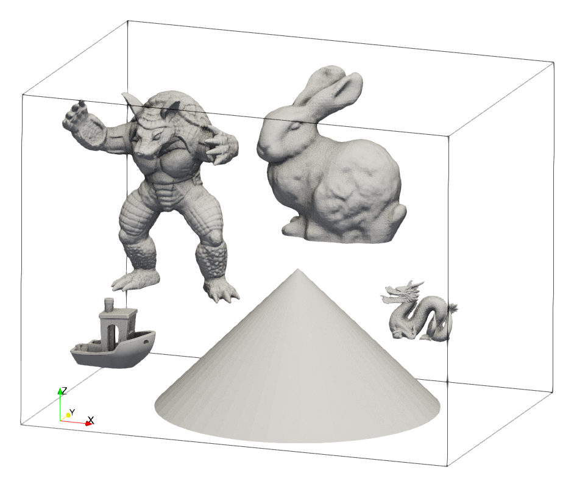
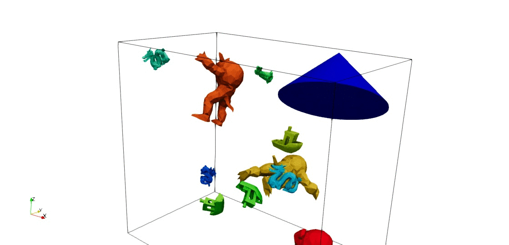

# KNAPSAK

This repository contains a simple Python implementation of a solution procedure for variants of (what is sometimes referred to as) the Orthogonal Minimum Container Packing problem [[1]](#1). We utilize VTK data structures and methods, and the simulated (dual) annealing optimization algorithm in SciPy. The implementation captured here is intended to form a basis for study of cutting-stock, knapsack, and bin packing problems, with more sophisticated and/or specialized optimization algorithms.

## Setup

We require Python 3 with [NumPy](https://numpy.org/), [SciPy](https://scipy.org/), and [VTK](https://vtk.org/) packages installed.

A virtual environment may be convenient for this. On a Linux system, create a virtual environment `env` and install the required packages with the following commands:
```
$ python3 -m venv ./env
$ source env/bin/activate
$ pip install -r requirements.txt
```
Or on a Windows system, using Powershell:
```
> python3 -m venv .\env
> .\env\Sctripts\Activate.ps1
> pip install -r .\requirements.txt
```

## Usage
Pack _n_ copies of each _mesh_ into an axis-aligned bounding box with a minimized volume:
```
python main.py opt_str vis_flg n1 mesh1.stl n2 mesh2.stl ...
```
_opt_str_ specifies the variant of the problem, and may take the following values:
- _boxsix_ : axis-aligned bounding box collisions with 6 rotations.
- _soxsix_ : axis-aligned bounding box collisions with 6 rotations and scaling along each coordinate axis.
- _obj24r_ : decimated STL mesh collisions with 24 rotations; all those [rotations](https://www.euclideanspace.com/maths/geometry/rotations/axisAngle/examples/index.htm) which map a cube unto itself.
- _objall_ : decimated STL mesh collisions with all rotations.

_vis_flg_ : switches on (1) or off (0) rendering the latest minimum during the optimization process.

Note:
- A decimation procedure, which reduces the number of triangles in each mesh to 1000, is applied internally.
- Meshes are increased in size by 1\% in the STL-mesh-based collision detection.   
- The simulated (dual) annealing algorithm is set to terminate after 1 million function evaluations in the case of STL mesh collision detection, and 10 million evaluations in the case of axis-aligned bounding box based collisions.   

## Examples

<p align="center" style="text-align: center; font-weight: bold;">

</p>
<p align="center" style="text-align: center; font-weight: bold;">
Figure 1: Example STL meshes (Armadillo, Stanford Bunny, 3DBenchy, Dragon, and a big cone).
</p>

```
python main.py objall 1 1 stl/Bunny.stl 2 stl/Armadillo.stl 3 stl/3DBenchy.stl 4 stl/Dragon.stl 1 stl/Cone.stl
```

<p align="center" style="text-align: center; font-weight: bold;">
  
</p>
<p align="center" style="text-align: center; font-weight: bold;">
  Figure 2: Packing one bunny, two armadillos, three benchy boats, four dragons, and one big cone, with all rotations permitted and collisions detected on decimated STL meshes.
</p>

To be continued.

## References
<a id="1">[1]</a>
Alt, H., & Scharf, N. (2018).
Approximating smallest containers for packing three-dimensional convex objects. International Journal of Computational Geometry & Applications, 28(02), 111-128.
